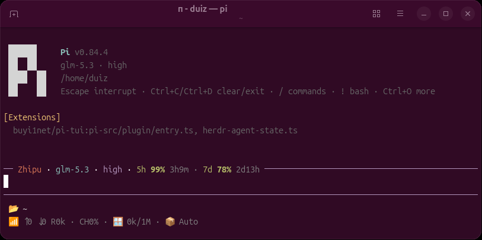

# pi-tui

[](./LICENSE)
[](https://github.com/badlogic/pi-mono)
[](https://github.com/buyi1net/pi-tui/issues)



`pi-tui` 是 Pi 的终端界面增强插件。它不替换 Pi 的交互逻辑，而是在保留原生输入体验的基础上，重新组织编辑器、项目状态、会话用量和供应商用量信息，让每次对话的运行状态更容易查看。


## 功能

### 编辑器与顶部信息

- 使用传统长方形输入框，保留 Pi 原生的历史记录、自动补全、粘贴、快捷键和 IME 输入行为。
- 输入框顶部显示当前供应商、模型、Thinking 状态、API 余额和订阅额度。
- 顶部的 `Pi` 标识使用 Pi 当前主题的强调色，不额外内置或安装第三方主题。

### 项目与 Git 状态

- 在输入框下方显示当前项目路径、运行时信息和 Git 状态。
- Git 状态包含分支及工作区变化等信息；后台刷新采用异步方式，不阻塞输入，也避免状态行反复跳动。
- 状态区域会根据终端宽度收缩，尽量在有限宽度下保留重要信息。

### 会话与模型运行数据

- 在回复尾部显示本轮首 Token 延迟、生成速度、Token 数量、缓存命中、上下文占用、耗时和预估费用等信息。
- 会话遥测以 Pi 自定义条目的形式保存在本机会话文件中，不会写入模型上下文。
- 支持显示自动压缩等会话状态，帮助判断当前上下文是否正在接近限制。

### 供应商用量

- 根据 Pi 当前模型注册表识别供应商，显示可用的 API 余额和订阅窗口。
- 支持供应商用量缓存和定时刷新，避免每次界面刷新都重复请求。
- 切换账号或模型后隔离旧的用量数据；无法可靠识别的地址不会被插件主动探测。

### 启动与重载体验

- 冷启动和 `/reload` 期间暂时隐藏不完整的中间帧，准备完成后再显示完整界面。
- 插件卸载或停用时恢复 Pi 默认的 Editor、Footer、工作指示器和终端光标状态。

## 安装、更新与卸载

要求：Pi `0.84.2` 至 `0.84.x`，Node.js `22.19+`。

```bash
# 安装
pi install git:github.com/buyi1net/pi-tui

# 验证安装
pi list

# 查看或启用/禁用已安装的包
pi config

# 更新
pi update git:github.com/buyi1net/pi-tui

# 卸载
pi remove git:github.com/buyi1net/pi-tui
```

安装或更新后重启 Pi；如果 Pi 已经打开，执行 `/reload`。使用 `pi list` 确认列表中存在 `git:github.com/buyi1net/pi-tui`。如果插件被包管理设置禁用，在 `pi config` 中重新启用后再执行 `/reload`。

插件首次启动时默认会把自身调整到全局 `packages` 列表首位，使界面闸门尽早加载；其它包的顺序保持不变。如需禁止这项调整，在 Pi 全局 `settings.json` 中设置：

```json
{
  "piTuiKeepPackageOrder": true
}
```

也可以设置环境变量 `PI_TUI_KEEP_PACKAGE_ORDER=1`。

## 配置

插件不提供主题配置，也不携带主题文件。界面颜色（包括 `Pi` 标识的蓝色强调色）跟随 Pi 当前启用的宿主主题；插件不会在 `/settings` 中增加第三方主题选项。`/settings` 仍可用于修改 Pi 宿主本身的主题，但这不是 pi-tui 的插件配置。

插件自身的可选配置文件位于 Pi 全局配置目录：

```text
<agentDir>/pi-tui.json
```

修改后执行 `/reload`。没有配置文件时使用以下默认行为：显示编辑器和顶部信息，状态预设为 `default`，启用会话遥测，供应商用量每 60 秒刷新一次，使用默认工作指示器。

配置示例：

```json
{
  "schemaVersion": 1,
  "appearance": {
    "editor": true,
    "header": true
  },
  "status": {
    "preset": "default",
    "segments": null
  },
  "data": {
    "providerRefreshMs": 60000,
    "telemetry": true
  },
  "advanced": {
    "spinner": "default"
  }
}
```

常用环境变量（环境变量优先于配置文件）：

- `PI_UI_STATUS_PRESET=minimal|default|full`：选择状态预设。
- `PI_UI_STATUS_SEGMENTS=<逗号列表>`：控制状态段及其顺序，可用值包括 `provider`、`model`、`thinking`、`balance`、`subscription`、`tokens`、`cache`、`context`、`project`、`git`、`runtime`、`duration`、`extensions`。
- `PI_TUI_KEEP_PACKAGE_ORDER=1`：禁止插件自动调整包顺序。

配置中涉及供应商凭据时，请勿把包含真实密钥的文件、截图或日志上传到 GitHub Issues。

## 公开仓结构

```text
pi-src/       # Pi 专属源码、测试和编译产物
packages/     # Pi 与其它宿主共用的供应商能力
```

用户不需要安装或维护源码目录中的开发依赖。

## 隐私与安全

- Git 与 Runtime 查询只在本机执行。
- 供应商查询使用 Pi 当前模型注册表解析后的地址与凭据；未知地址不会被探测，也不会把凭据发送到其它域名。
- 缓存只保存不可逆账号指纹和归一化用量快照，不保存 API Key 原文。
- 会话遥测作为 Pi 自定义条目保存在本机会话文件中，不会进入模型上下文。
- 详细边界见 [PRIVACY.md](./PRIVACY.md)。

## 反馈

请在 [GitHub Issues](https://github.com/buyi1net/pi-tui/issues) 报告问题，并附上 Pi 版本、操作系统、终端名称和复现步骤。不要上传 API Key、完整配置或包含凭据的日志。

## License

[MIT](./LICENSE)。
